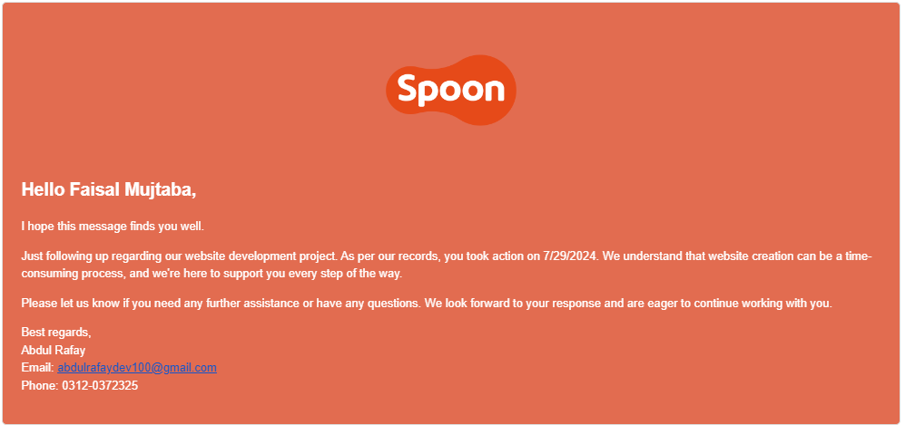
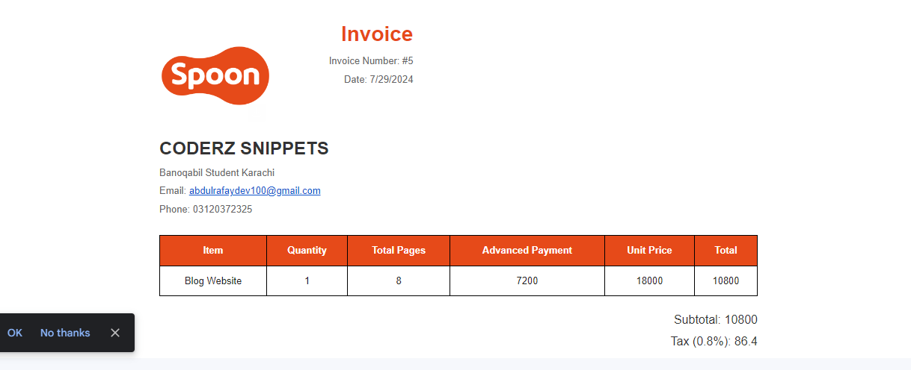

# Client Order Management System

## Overview

This project is designed to manage client orders for website development. It includes tracking whether clients place orders, recording payments, monitoring delivery statuses, and managing follow-up emails. The data is recorded in an Excel sheet for easy access and analysis.

## Columns

The main columns in the Excel sheet are:

- **Client Name**: The name of the client.
- **Website Order (Yes/No)**: Indicates whether the client has placed a website order.
- **Half Payment Received (Yes/No)**: Indicates whether the client has paid half of the payment in advance.
- **Delivery Status (True/False)**: Indicates whether the website has been delivered.
- **Follow-up Email Date**: The date when a follow-up email should be sent.

## Functionality

### If Client Gives an Order

1. **Record the Order**:
    - The order is recorded in the Excel sheet under the relevant columns.

2. **Half Payment Received**:
    - If the client pays half in advance, mark it in the sheet.

3. **Delivery Status**:
    - When the delivery status is marked as true, an email receipt for the remaining payment is sent.

### If Client Does Not Give an Order

1. **Record the Decision**:
    - The client's decision is recorded in the sheet.

2. **Track Decision Time**:
    - Track the time taken by the client to decide.

3. **Send Follow-up Email**:
    - A follow-up email is sent from the day they start thinking about the order.

## Usage

1. **Setup**:
    - Ensure you have Python installed on your system.
    - Install the required libraries using:
      ```bash
      pip install  smtplib email
      ```

2. **Configuration**:
    - Configure your email settings in the script for sending follow-up emails and payment receipts.

3. **Running the Script**:
    - Run the script to start managing client orders and sending emails.
      ```bash
      python manage_orders.py
      ```

## Follow-up Message Template



## Invoice



## Contributing

Contributions are welcome! Please feel free to submit a Pull Request.

## License

This project is licensed under the MIT License.

## Contact

For any inquiries or issues, please contact Abdul Rafay.

---

This README file provides all necessary information for setting up, configuring, and running the Client Order Management System. Be sure to replace placeholder values with actual data and customize the paths to the images as needed.
